# Frontend for Task Tracker Application

This project is the frontend built using React for a task tracker application that uses the [Task Tracker API](https://github.com/adriarodr/task-tracker-api) I made. The application allows users to register, log in, and manage their tasks through the browser.

## Main Features

This application features:

- A registration form for users to create an account
- A login form for users to sign in and manage tasks
- Users can view, add, edit, and delete their tasks through buttons and form modals.
- Error, loading, and success messages
- Handles the JWT token from login to allow access to protected views through conditional rendering

## Technologies Used

### Development

- **[Visual Studio Code](https://code.visualstudio.com/)**
- **[ESLint](https://eslint.org/)** and **[Prettier](https://marketplace.visualstudio.com/items?itemName=esbenp.prettier-vscode)** to lint and format the code to prevent errors
- **[eslint-config-prettier](https://github.com/prettier/eslint-config-prettier)** to use ESLint and Prettier together without conflicts

### Dependencies

- **[Vite](https://vite.dev/)** with the **[React Framework](https://react.dev/)** to build the frontend

## Instructions for Local Setup

### Prerequisites

- A code editor such as **[Visual Studio Code](https://code.visualstudio.com/)**
- **[Node.js (LTS Version recommended)](https://nodejs.org/en)** version 24.15.0 or above installed
- **[Git](https://git-scm.com/)** to clone and manage the repository
- **[Task Tracker API](https://github.com/adriarodr/task-tracker-api)** for the backend

### How to run the backend locally

Please review the [Task Tracker API](https://github.com/adriarodr/task-tracker-api) page for the prerequisites and detailed instructions for local backend setup.

#### Steps for the Backend

**Note:** For easy development, I recommend creating a folder with a name such as `task-tracker-app` to contain both the backend and frontend repositories.

##### 1. Clone the Task Tracker API repository

Open your terminal and run the following commands to clone the project:

```bash
git clone https://github.com/adriarodr/task-tracker-api.git
cd task-tracker-api
```

##### 2. Install the Dependencies for the Backend

Install all the required packages in the `package.json` using the following command:

```bash
npm install
```

##### 3. Create a `.env` file for the Backend

Either duplicate the `.env.example` file and rename it to `.env`, or create a new `.env` file and add the required variables mentioned in the README on the Task Tracker API repository.

##### 4. Start the Backend Server

Start the local server with:

```bash
npm start
```

or, if you want Node.js to automatically restart on file changes, use:

```bash
npx nodemon
```

To confirm that the API is running, visit `http://localhost:PORT/api/health` where PORT is the port number you set in `.env` or the default value 3000.

### How to run the frontend locally

#### Steps for the Frontend

##### 1. Clone the Task Tracker Frontend repository

Open your terminal and, next to the folder for the Task Tracker API, run the following commands to clone the project:

```bash
git clone https://github.com/adriarodr/task-tracker-frontend.git
cd task-tracker-frontend
```

##### 2. Install the Dependencies for the Frontend

Install all the required packages in the `package.json` using the following command:

```bash
npm install
```

##### 3. Create a `.env` file for the Frontend

Either duplicate the `.env.example` file and rename it to `.env`, or create a new `.env` file and add the required variables mentioned in the [List of Required Environment Variables](#list-of-required-environment-variables).

##### 4. Start the Frontend Server

In another terminal separate from the one running the Task Tracker API, start the local server with the following command:

```bash
npm run dev
```

## List of Required Environment Variables

The frontend requires the following environment variables:

```ini
VITE_API_URL=your_api_url
```

- `VITE_API_URL` is the base URL of the Task Tracker API

These variables are included in `.env.example`, so you can copy that file, rename it to `.env`, and add your own values.

## Image Citations

All images used in this project are CC0-licensed, openly licensed, or my original work. The list below organizes them by category, with each including the photo's file name and either a note that it's original work or a link to the source page.

### Icons

| Icon        | File Name       | License | Credit                                                             |
| ----------- | --------------- | ------- | ------------------------------------------------------------------ |
| Plus Circle | plus-circle.svg | CC0     | [Link to the icon](https://www.svgrepo.com/svg/471792/plus-circle) |
| Trash Can   | trash.svg       | CC0     | [Link to the icon](https://www.svgrepo.com/svg/472001/trash-03)    |
| x Circle    | x-circle.svg    | CC0     | [Link to the icon](https://www.svgrepo.com/svg/472092/x-circle)    |
| Log In      | log-out.svg     | CC0     | [Link to the icon](https://www.svgrepo.com/svg/471636/log-in-03)   |
| Pencil      | pencil.svg      | CC0     | [Link to the icon](https://www.svgrepo.com/svg/471750/pencil-02)   |

## How was the Frontend Tested?

The frontend was tested locally by testing each view and confirming that the proper components render and error and loading messages display properly. Additionally, the frontend was testing to ensure it is responsive by using Firefox and Google Chrome DevTools.

Below shows the screenshots of each of the frontend's views.

### Registration

- [x] Displays a success message when registration is successful

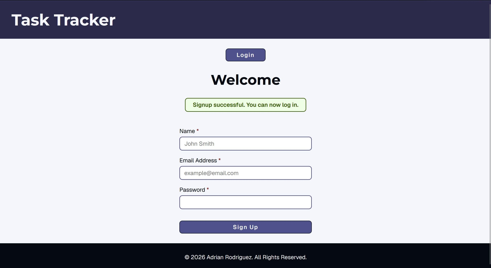

- [x] Displays an error message when users doesn't provide a name, email, or password

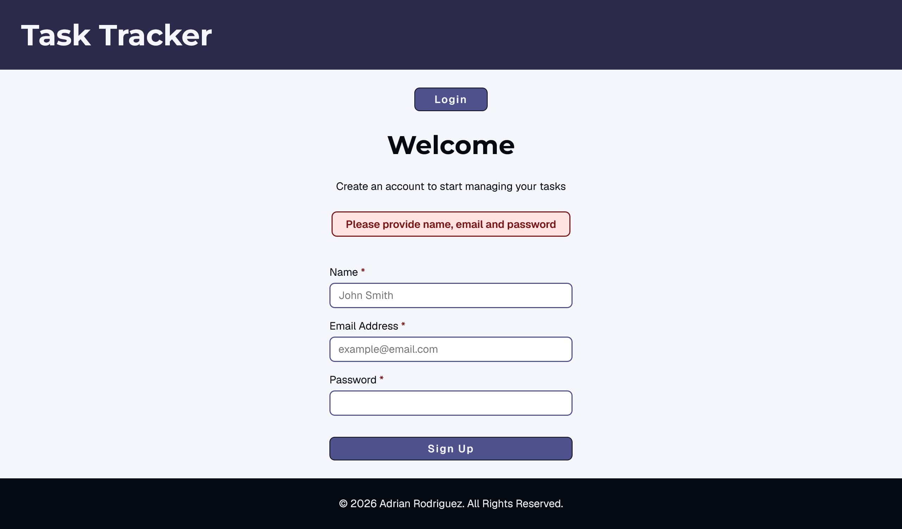

### Login

- [x] Displays the user's tasks after successfully logging in

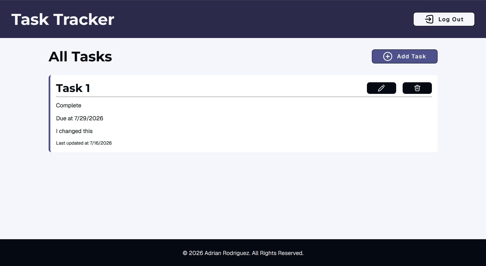

- [x] Displays an error message if the email or password are incorrect

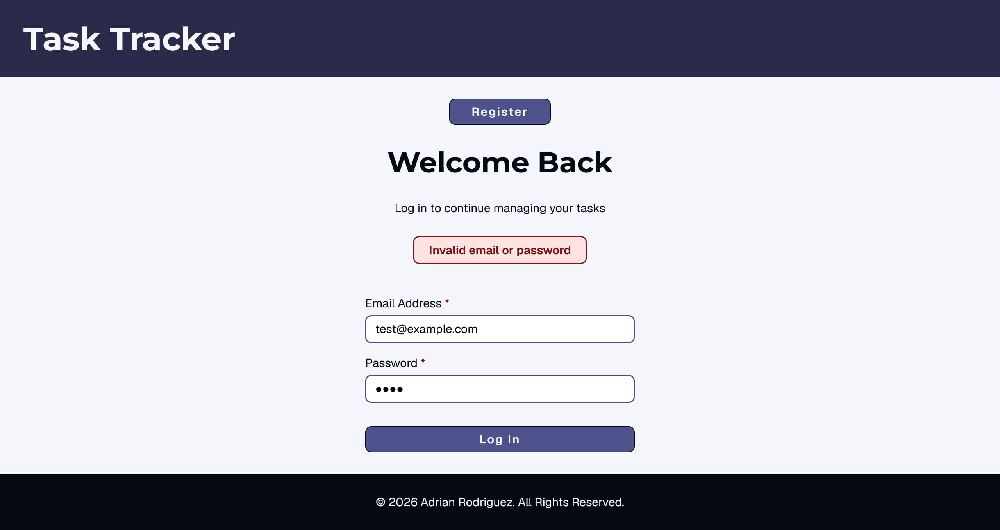

- [x] Displays error message when users doesn't provide an email or password

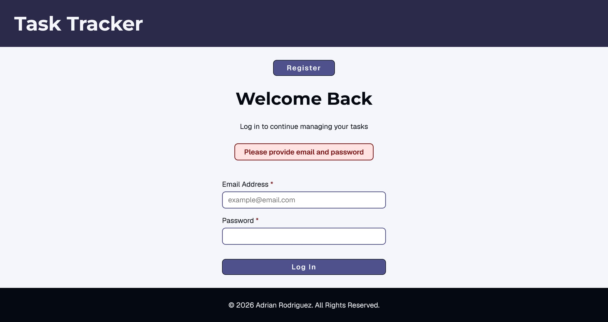

- [x] Alert successfully displays when the JWT token expires

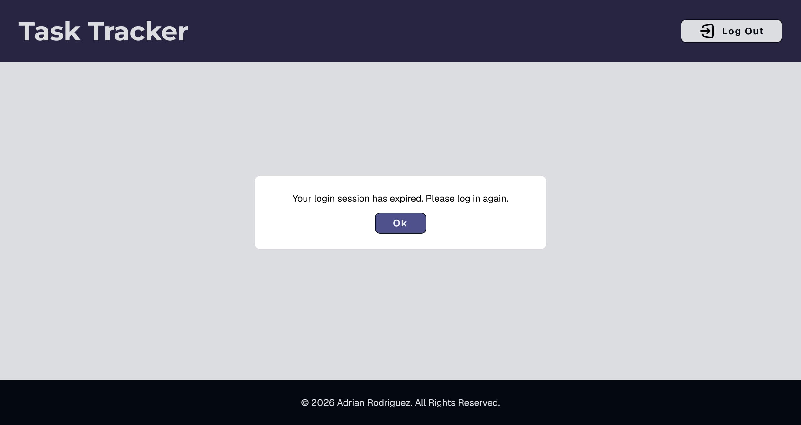

### Creating Tasks

- [x] Display a modal with a form when users click on add task

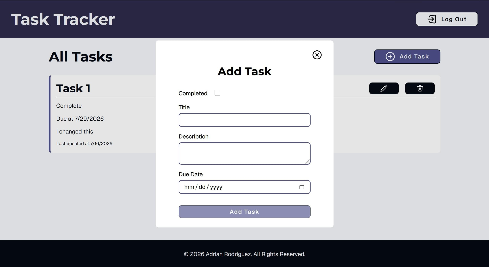

- [x] Task successfully appears on the list upon success

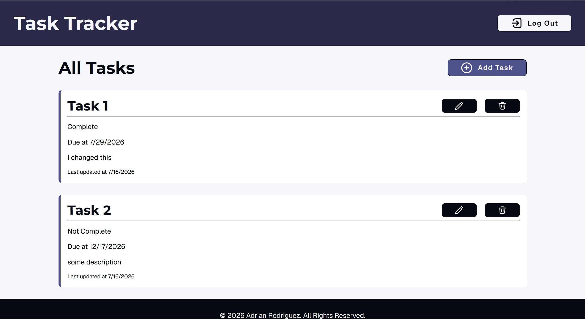

- [x] Displays an error message if users doesn't provide an title for task

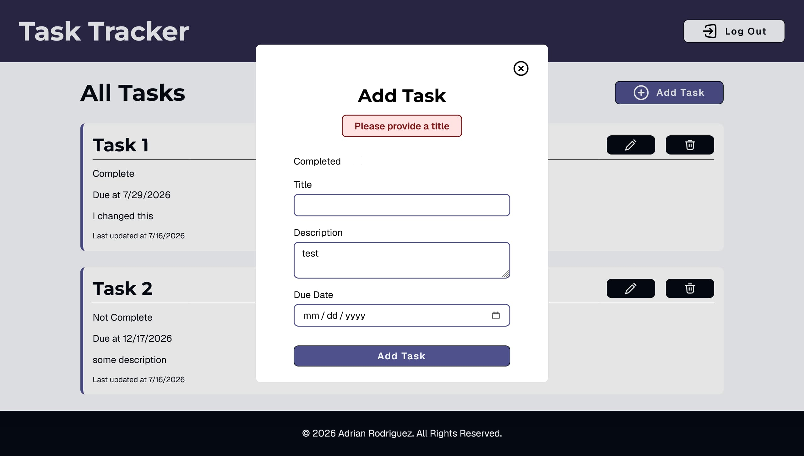

- [x] Displays an error message if user attempts to create a task that already exists

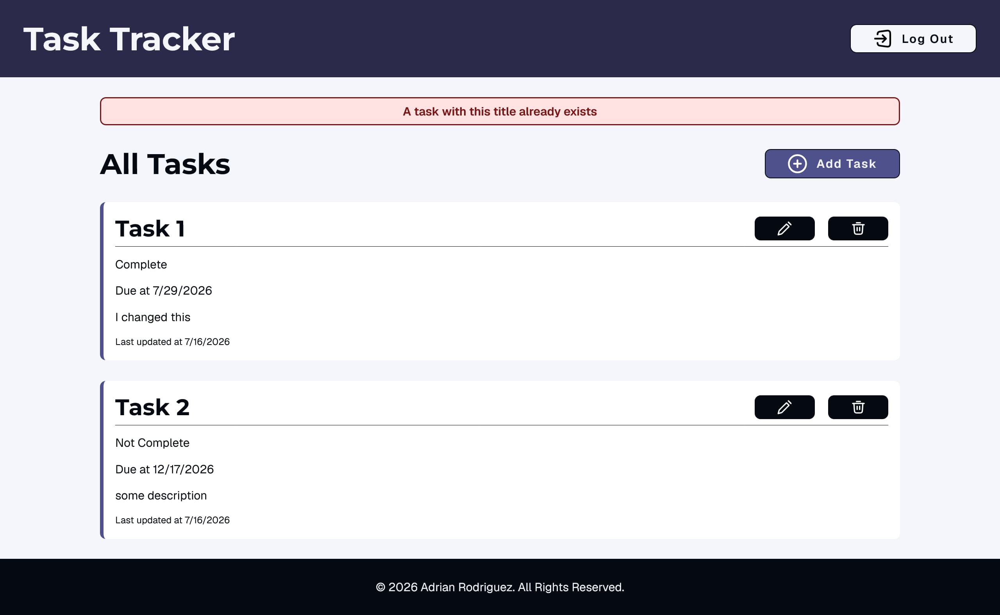

### Editing a Task

- [x] Display a modal with a form when users clicks on the edit button (button with a pencil icon)

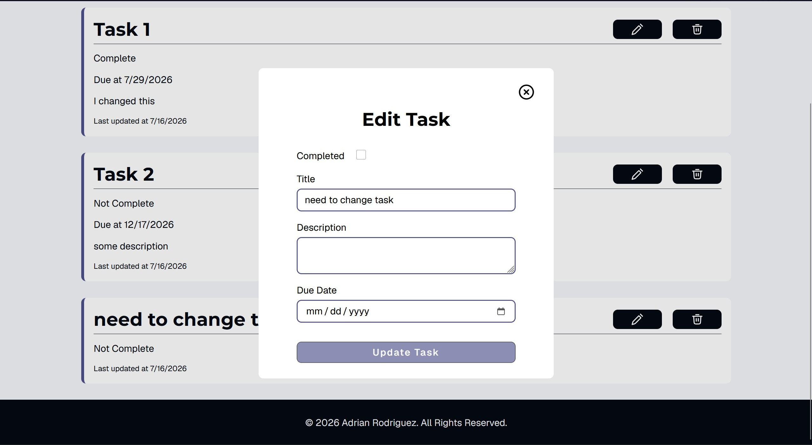

- [x] Task successfully displays the new information upon success

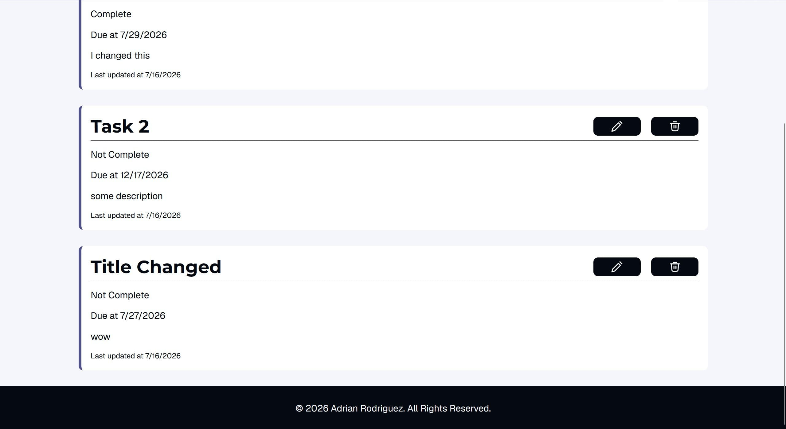

### Deleting a Task

- [x] Task successfully deletes if users clicks on the delete button on a task (button with the trash can icon)

Before pressing the delete button:

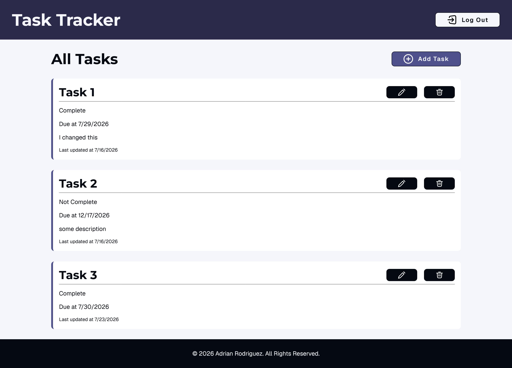

Task is gone after pressing the delete button

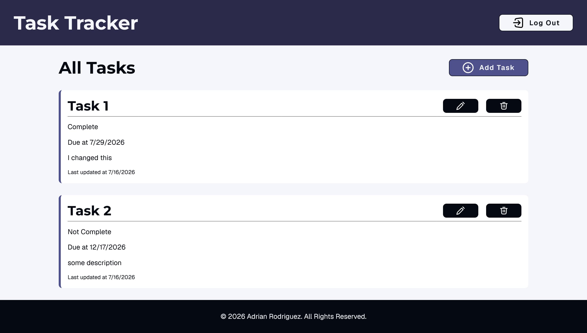

### Login out

## Known Issues or Future Improvements

### Known Issues

- Users are sent to the registration page instead of the login page when alerted to log in again
- Users can see the logout button when alerted that their login session expired (However, users can't click on it)
- Success messages for creating, updating and deleting tasks are missing
- Success message for logging out is missing

### Future Improvements

- Add confirmation for deleting tasks to prevent accidental deletions
- Have error messages display after a set amount of time
- Add routing and use useContext to pass states to deeply nested components
- Add custom hooks, useReducer, and separate components to reduce repetitive code and improve maintainability
- Add a search bar to allow users to search for specific tasks
- Add a checkbox next to task titles so users can easily check off tasks
